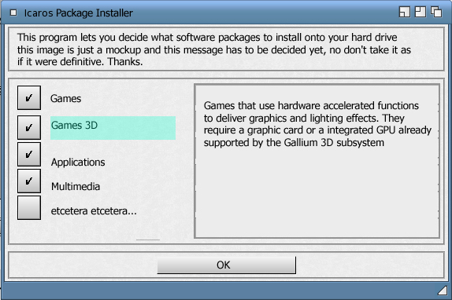

# Icaros install package manager

These are the recovered sources for a little tool I wrote for the Icaros distribution.

The purpose is to assist the user in the installation process, choosing the packages to install.

I think it looked like something like this:

### Learn more

Aros: http://www.aros.org

Icaros: https://vmwaros.blogspot.com
